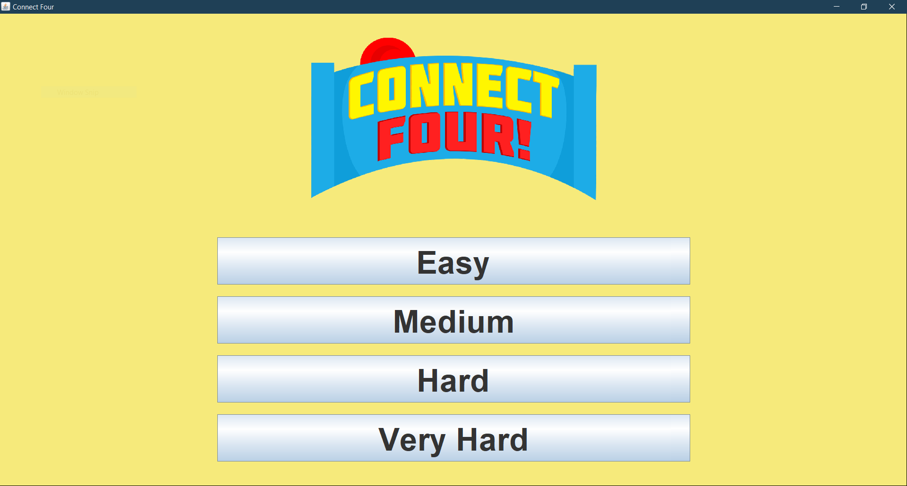
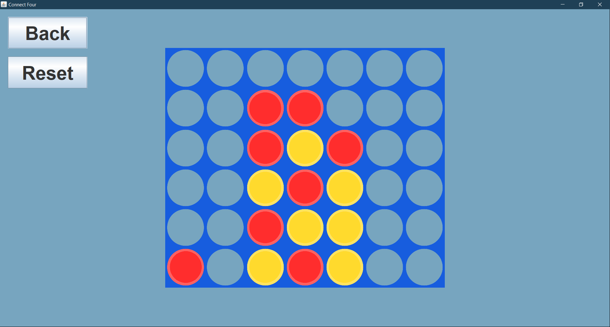
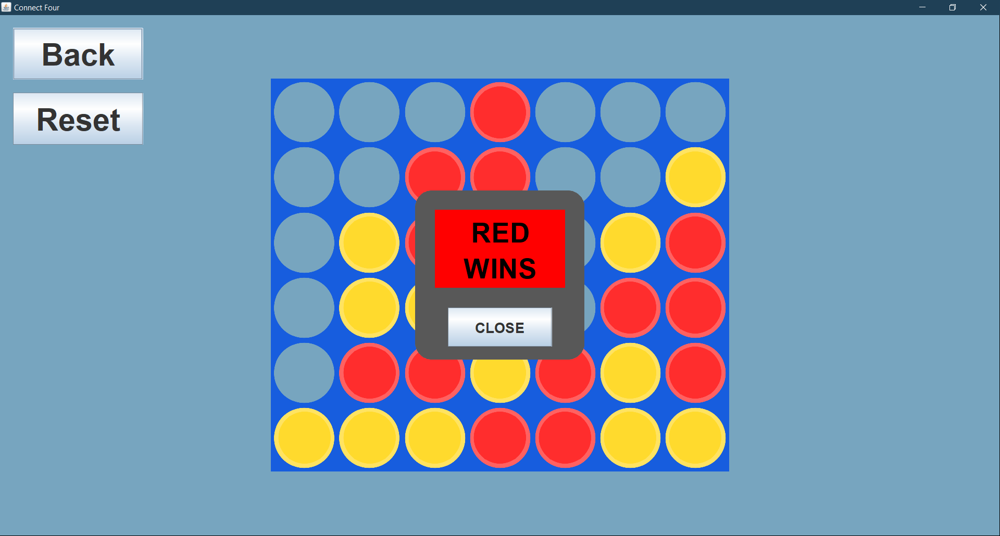
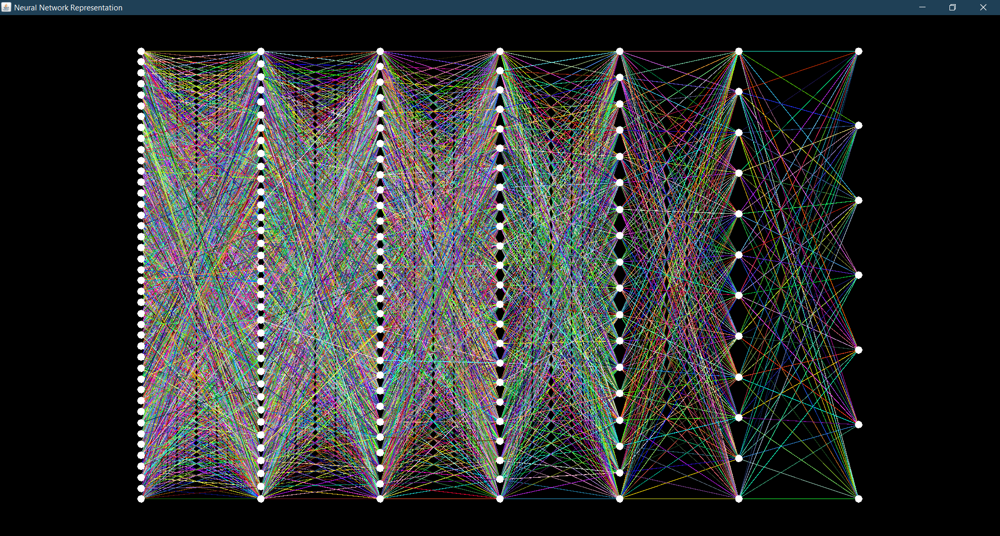
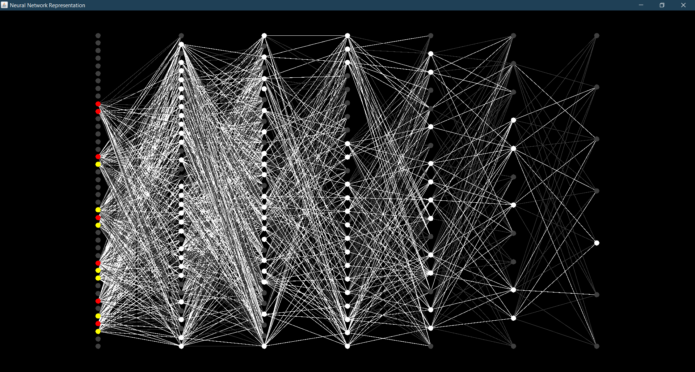
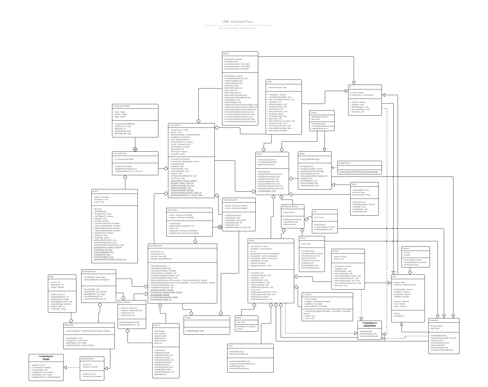
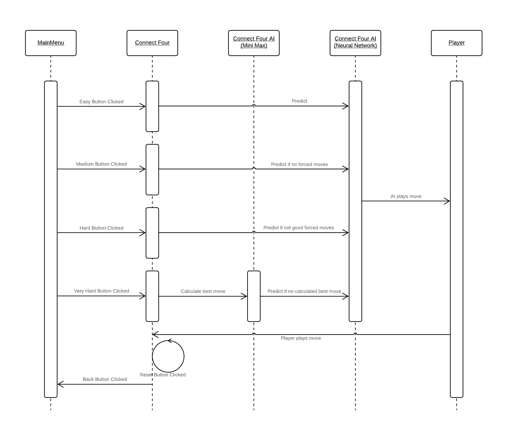

# Connect Four AI
By Cole, Zeb, and Kestt

## About:
This Connect Four AI has multiple levels of difficulty. It uses a trained Neural Network 
and an optimized MiniMax algorithm

## Screenshot(s):

## UML Class+Relationship Diagram:

## Sequence Diagram (for driver):

